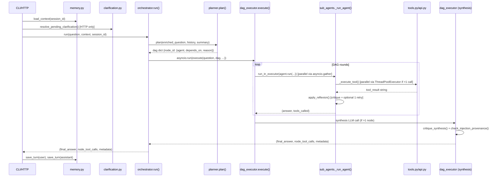

# Orchestration Architecture — Code-Grounded Reference

Traced directly from `query/*.py` as of the current `master` working tree.
Every claim below cites the file and function/line it came from. Where
behavior had to be inferred rather than directly observed, it's flagged
explicitly as **[INFERRED]**.

---

## 1. Entry Points

### 1a. CLI — `query/agent.py`

- `main()` (`agent.py:112`) → `parse_args()` (`agent.py:19`) parses:
  `--session`, `--question`, `--list-sessions`, `--clear-session`,
  `--no-memory`, `--verbose` (defaults to `True`).
- Three sub-modes inside `main()`:
  - `--list-sessions` → `memory.list_sessions()`, prints, returns (no agent logic).
  - `--clear-session` → `make_session_id()` (`agent.py:38`, lowercases + hyphenates) →
    `memory.clear_session(sid)`, returns.
  - `--question "..."` → `run_question()` (`agent.py:43`), single-shot.
  - No `--question` → `interactive_loop()` (`agent.py:76`), a REPL that calls
    `run_question()` per line; has its own `history`/`exit`/`quit`/`q` commands
    handled *before* reaching the orchestrator.
- **State initialized before any agent logic:** `session_id` is normalized
  (`make_session_id`), then `run_question()` calls
  `memory.load_context(session_id)` (`agent.py:52`) — this is the *only*
  state constructed pre-orchestration. No other session object exists.
- First real orchestration call: `orchestrator.run()` (`agent.py:58`,
  imported as `orchestrate`).

### 1b. HTTP — `query/server.py` (FastAPI)

- `POST /ask` (`server.py:82`, `AskRequest{question: str, session_id: str|None}`)
  is the only agent-invoking route. Body validated by pydantic
  `AskRequest`/`AskResponse` (`server.py:41-48`).
- Sequence inside `ask()`:
  1. `memory.load_context(session_id)` via `run_in_threadpool` (`server.py:87`) —
     identical function to the CLI path, just thread-offloaded since FastAPI
     is async and `load_context` is a synchronous boto3 call.
  2. `clarification.resolve_pending_clarification(session_id, question)`
     (`server.py:93`, threadpooled) — **this runs before orchestration and
     can silently rewrite `request.question` into a merged question** if a
     clarification was pending from the previous turn (see §2.3).
  3. `orchestrator.run(effective_question, context=context, ...)`
     (`server.py:98`).
- Other routes: `/health`, `/`, `/admin`, `/chat/{session_id}` (static file
  serving only — no agent logic). `/chart/{chart_id}` (`server.py:154`) is a
  polling endpoint for async chart-building (see §2.8). `/admin/api/*`
  routes (`server.py:169-238`) delegate to `query/admin.py` — pipeline
  status, session browsing, telemetry browsing, and an eval-runner trigger
  (`admin_module.trigger_eval_run`). These are dashboard/ops surfaces, not a
  second orchestration entry point — `admin.py` never imports `orchestrator`.
- **No Lambda handler found** in any of the files read. `admin.py`'s
  `SOURCES` dict (`admin.py:37-47`) references Glue job/crawler names
  suggesting the *data ingestion* side runs on Glue/Lambda, but that's
  outside `query/` and outside this doc's scope. **[INFERRED — not verified
  by reading CDK stacks]**.

### 1c. Eval harness — `query/evaluations/run_eval.py`

Not in the requested file list, but discovered via grep because it's the
only other caller of `orchestrator`-adjacent internals
(`check_advice_boundary`, `check_scope_boundary`, `check_trajectory_adaptation`
— see §5). It calls "the real planner + executor (same code path as
query/agent.py)" per its own docstring, then runs additional offline judges
on the output purely for scoring. This is relevant because those three
judge functions are **not** part of the live request path — see the
Guardrails Inventory note in §5.

---

## 2. Full Request Lifecycle



### 2.1 Entry point receives request
See §1. Both CLI and HTTP converge on `orchestrator.run()` (`orchestrator.py:18`)
with the same signature: `(question, context, verbose, session_id)`.

### 2.2 Memory load
`memory.load_context(session_id)` (`memory.py:96`) returns:
```python
{"summary": str|None, "context_note": str|None, "recent_turns": list[dict]}
```
- `recent_turns` = `load_turns(session_id, max_turns=KEEP_RAW)` where
  `KEEP_RAW = RAW_TURNS_THRESHOLD - COMPRESS_BATCH = 8 - 3 = 5` (`memory.py:35-37`).
  So **at most the last 5 raw turns** are loaded, always via a DynamoDB
  `query()` with `ScanIndexForward=False` (`memory.py:124-128`) filtered
  through `is_real_turn()` (`memory.py:64`) to exclude the `SUMMARY` and
  `PENDING_CLARIFICATION` sort-key rows.
- `summary` = the single `SUMMARY`-keyed item's `content` field, a
  structured text blob (`ENTITIES:`/`TIME_SCOPE:`/`CONFIRMED_FACTS:`/
  `PENDING:`/`CONTEXT_NOTE:`) written by `_call_haiku_compress()`
  (`memory.py:277`).
- `context_note` = just the `CONTEXT_NOTE:` line(s) pulled out of that
  summary via `_extract_context_note()` (`memory.py:320`) — a lightweight
  string injected into `orchestrator.run()`'s `enriched_question`
  (`orchestrator.py:49-50`) without dragging the full summary into every
  sub-agent's context.
- **Compression is not synchronous with load** — it only fires on the
  *write* path. `save_turn()` (`memory.py:77`) always writes the raw turn
  first, then checks `_count_raw_turns(session_id) > RAW_TURNS_THRESHOLD`
  (i.e. > 8) and if so calls `_compress()` (`memory.py:245`), which absorbs
  the oldest `COMPRESS_BATCH = 3` raw turns into the rolling summary via one
  Haiku call and deletes them. This means compression lags one turn behind
  — a session only compresses *after* the 9th raw turn is saved, and the
  compression itself happens post-response in the CLI (`agent.py:69-71`,
  synchronous but after the answer is already computed) and via
  `BackgroundTasks` in HTTP (`server.py:112-117`, genuinely non-blocking).

### 2.3 Clarification pre-check (HTTP only, and eval harness)
Not present in the CLI path (`agent.py` never imports `clarification`).
`clarification.resolve_pending_clarification()` (`clarification.py:46`)
checks `memory.get_pending_clarification(session_id)` — if a clarify
sentinel was returned last turn, this classifies (single Haiku call,
`classify_and_merge()` at `clarification.py:78`) whether the new message
answers it, and if so rewrites the question into a merged, standalone
question before the planner ever sees it. Pending state is **unconditionally
cleared** either way (`clarification.py:74`) — a clarification only ever
gets one chance to be answered; a follow-up on turn N+2 is treated as a
fresh question.

### 2.4 Planner invocation — `planner.py:plan()`
- Prompt construction (`planner.py:390-429`): `PLANNER_SYSTEM` (a ~350-line
  constant, `planner.py:28-387`) is cached via
  `cache_control: {"type": "ephemeral"}` (`planner.py:419`) and includes:
  today's date (`datetime.date.today()`, baked into the string at import
  time — see §7 for why that's a gap), `get_agent_descriptions()`
  (`registry.py:92`, one paragraph per registered agent), a hard-coded
  SCOPE BOUNDARY section, a CLARIFICATION BOUNDARY section, per-agent
  capability boundaries, content-routing keyword rules, MERGE/FAN-OUT
  multi-hop DAG-shape guidance, and an IMPLICIT DATE RESOLUTION table
  (e.g. "recently" → last 30 days).
- The user-turn content is built separately per call (`planner.py:397-413`):
  optional `<session_memory>` block (from `summary`), last 4 history turns
  truncated to 200 chars each, then the question.
- Model: `PLANNER_MODEL` = `claude-sonnet-4-6` if `ENV=="prod"` else
  `claude-haiku-4-5-20251001` (`planner.py:20-24`).
- **Output schema expected:**
  ```json
  {"agents": {"node_id": {"agent": "...", "depends_on": [...], "reason": "..."}}, "reasoning": "..."}
  ```
  or one of two sentinel shapes — `{"agents": {"decline_1": {"agent": "decline", ...}}}`
  or `{"agents": {"clarify_1": {"agent": "clarify", "question_for_user": "...", ...}}}`.
- **Parsing** (`planner.py:431-449`): strips ```` ```json ```` fences, then
  `json.loads()`. On `JSONDecodeError`, falls back to
  `dag = {"macro": {"depends_on": [], "reason": "fallback"}}` **and writes a
  synthetic `Trace` record** via `fail_trace.record_planner_parse_failure()`
  (`planner.py:441-449`) so parse failures are queryable in telemetry even
  though nothing is printed when `verbose=False` (e.g. during evals).
- **Malformed/truncated output handling flow:**
  ```
  json.loads() fails
    → dag = {"macro": {...fallback...}}, reasoning = "planning failed..."
    → flush a Trace with agent="planner" recording raw_output[:2000] + stop_reason
    → falls through to registry validation below (macro is valid, survives)
  ```
- **Sentinel handling** (`planner.py:451-486`) — checked *before* registry
  validation, specifically because `"decline"` and `"clarify"` are
  deliberately **not** registered agent types (`registry.py` only knows
  `market/macro/filings/sentiment`). The code comment at `planner.py:451-459`
  explains this ordering exists precisely to prevent a JSON-parse failure or
  a registry-filter miss from silently routing an off-topic question to a
  real agent (e.g., the `macro` fallback) — a previously-real bug class.
- **Registry validation** (`planner.py:488-500`): filters `dag` to only
  `agent` values in `list_agents()`, drops now-dangling `depends_on`
  references, and if the dict is empty after filtering, defaults to
  `{"market_1": {"agent": "market", "depends_on": [], "reason": "fallback"}}`.
  This is a **second, independent fallback path** distinct from the JSON
  parse failure fallback above — it fires even on a syntactically valid
  LLM response if every listed agent name is bogus.

### 2.5 DAG executor — `dag_executor.py:execute()`
- **Not a generic topological sort with a library** — it's a hand-rolled
  round-based walk (`execute()` lines 292-373, mirrored by planner's own
  `_resolve_rounds()` at `planner.py:512` used only for the `verbose` print
  preview, not for actual execution):
  ```python
  while remaining:
      ready = [n for n in remaining if all(dep in completed for dep in dag[n]["depends_on"])]
      if not ready: ready = list(remaining)   # deadlock — force everything through
      results = await asyncio.gather(*tasks)  # one asyncio.gather per round
  ```
  A cycle or a dependency on a node that never got scheduled produces a
  "DAG deadlock — forcing remaining" print (`dag_executor.py:303-307`) and
  runs everything left over in one final round regardless of stated
  dependencies — **not a hard failure**, just a soft degrade to running
  possibly-unready nodes.
- **Genuinely parallel, not fake-async:** each ready node's `agent.run()`
  (a synchronous, blocking call) is wrapped via
  `loop.run_in_executor(None, lambda: agent.run(...))` (`dag_executor.py:124-134`)
  — `None` means the default `ThreadPoolExecutor`. Multiple nodes in one
  round genuinely execute on separate OS threads concurrently, gathered via
  `asyncio.gather(*tasks)` (`dag_executor.py:364`). Confirmed, not inferred.
- **Special-cased single-node shortcuts** happen *before* the round loop:
  - `dag` of length 1 with `agent=="decline"` → returns
    `SCOPE_DECLINE_MESSAGE` (`dag_executor.py:53-59`) directly, **no agent is
    ever invoked** (`dag_executor.py:253-259`).
  - `dag` of length 1 with `agent=="clarify"` → returns
    `question_for_user` directly with `metadata={"awaiting_clarification": True}`
    (`dag_executor.py:261-269`) — again no agent invoked.
  - `dag` of length 1 with a real agent → runs it, applies the injection
    check unconditionally, and returns **without ever calling synthesis**
    (`dag_executor.py:272-290`) — synthesis only runs for `len(dag) > 1`.
- **Passing state between dependent nodes** (`dag_executor.py:313-361`):
  for a node with non-empty `depends_on`, the question sent to it is not
  the raw question — it's rebuilt as:
  ```
  {question}

  Context from prior analysis (verified by a different specialist...):
  MANDATORY CITATION FORMAT: ... [from prior step: ...] ...

  [AGENT ANALYSIS (node_id) — VERIFIED BY X, NOT BY YOU]
  {completed[dep_answer]}
  ```
  For a node running **in parallel with siblings but no deps**, it instead
  gets a role-scoping hint ("focus on {role} only... don't ask for
  clarification about data outside your domain") rather than the citation
  block. A node that's alone in its round with no deps gets the bare
  question. This is a real three-way branch (`dag_executor.py:324-361`),
  not a single code path.

### 2.6 Sub-agent invocation — `sub_agents.py:_run_agent()`
Shared ReAct loop for all four specialists (`MarketAgent`, `MacroAgent`,
`FilingsAgent`, `SentimentAgent` — each just a thin `.run()` wrapper at
`sub_agents.py:859-1089` passing its own system prompt / tool subset /
budget / iteration cap into the same `_run_agent()`).

- **Model**: `MODEL = "claude-haiku-4-5-20251001"` (`sub_agents.py:29`) —
  **hard-coded, not `ENV`-branched**, unlike `PLANNER_MODEL`/`SYNTH_MODEL`/
  `CRITIC_MODEL`. See §7 — this means sub-agent reasoning always runs on
  Haiku even in `prod`, while planning/synthesis/critique upgrade to Sonnet.
- **Per-agent budgets** (`sub_agents.py:860-1089`):

  | Agent | `TOKEN_BUDGET` | `MAX_ITER` |
  |---|---|---|
  | Market | 50,000 | 8 |
  | Macro | 50,000 | 8 |
  | Filings | 150,000 | 15 |
  | Sentiment | 75,000 | 10 |

- **Loop structure** (`_run_agent`, `sub_agents.py:517-716`), a Python
  `for...else`:
  ```
  for iteration in range(max_iter):
      if trace.input_tokens + trace.output_tokens > token_budget:
          answer = "Token budget exceeded. Here is what was found so far:" + _extract_text_from_messages()
          break                                    # budget cap → early exit with partial synthesis
      response = client.messages.create(...)       # cached system + cached tools
      if stop_reason == "end_turn":
          if no tool_use AND "<scratchpad>" in text:
              nudge model to call a tool or answer; continue
          answer = text; break
      elif stop_reason == "tool_use":
          execute tools (parallel if >1, see §2.7), append tool_results, loop again
      else:
          answer = f"Unexpected stop reason: {response.stop_reason}"; break
  else:
      # only runs if the for-loop completed WITHOUT break — i.e. max_iter exhausted
      hit_max_iter = True
      forces a SEPARATE synthesis-only LLM call with no tools attached,
      instructed to "provide the best answer you can... Never return an empty answer."
  ```
  So there are exactly three distinct terminal states: token-budget cutoff
  (mid-loop `break`), max-iteration cutoff (the `else:` clause — a forced
  synthesis call), and normal `end_turn` completion. Every path guarantees
  `answer` is non-`None` before reaching reflexion.
- **Caching**: system prompt and tool list are both wrapped with
  `cache_control: {"type": "ephemeral"}` once per run (`sub_agents.py:508-515`),
  applied to the *last* tool in the list per Anthropic's cache-breakpoint
  semantics. Both `messages.create()` calls (primary and the try/except
  fallback without cache_control) are wrapped in `try/except Exception` —
  **[INFERRED]** this is defensive against transient cache-control API
  errors, not explained in a comment, but the pattern repeats identically in
  `planner.py`, `dag_executor.py`, and `memory.py`'s Haiku call is the only
  one that *doesn't* do this.

### 2.7 Tool execution — dispatch + parallelism
- Dispatch: `_execute_tool(name, inputs, agent_name)` (`sub_agents.py:835-843`)
  looks up `registry[name]` (built by `tools.get_registry()`,
  `tools.py:799-821`, a static dict mapping tool name strings to `api.py`
  function references) and calls `registry[name](**inputs)`. Any exception
  is caught and converted to a string: `f"Tool error ({name}): {e}"`
  (`sub_agents.py:841`) — **the model never sees a raw traceback**, only a
  short message it can react to.
- **Deduplication** happens *before* execution, not after
  (`sub_agents.py:602-609`): a `call_sig = f"{name}:{json.dumps(inputs, sort_keys=True)}"`
  set (`tool_call_seen`, scoped to one `_run_agent()` call, i.e. one DAG
  node) blocks exact repeat calls, returning a scripted nudge
  ("You already called X... use the previous result") instead of
  re-executing.
- **Parallelism within one turn** (`sub_agents.py:625-642`): if the model's
  response contains exactly one `tool_use` block, it runs directly; if
  more than one, they run via
  `ThreadPoolExecutor(max_workers=len(to_execute))` and
  `as_completed()`. This is genuine thread-level parallelism for
  same-turn multi-tool calls — **confirms LA-2 is done** (see §4, §7).
- Results are wrapped with `_wrap_tool_result()` (`sub_agents.py:816-832`)
  into `<tool_result>...</tool_result>` before being placed in the
  conversation — a structural (not just instructional) signal that this
  content is external data, distinct from the raw unwrapped copy kept on
  `Trace.tools_called[].result_full` for reflexion's grounding checks.

### 2.8 Reflexion — see §6 for full detail. Invoked:
- **Once per sub-agent run**, inside `_run_agent()` via
  `apply_reflexion()` (`sub_agents.py:795-802`) — i.e. per DAG node, not
  per-tool-call and not only at pipeline end.
- **Once more at the synthesis tail**, inside `dag_executor.execute()`
  via `critique_synthesis()` (`dag_executor.py:477`) — only when
  `len(dag) > 1` (synthesis only happens then).
- A **third, independent check** — `check_injection_provenance()` — runs
  on both the single-agent early-return path and the synthesis tail (see
  §5/§6), unconditionally, unlike the other two which have word-count
  skip-gates.

### 2.9 Synthesis — `dag_executor.py:execute()`, lines 389-437
- Only reached when `len(dag) > 1`. Builds `agent_outputs` — a
  concatenation of `[AGENT ANALYSIS (node_id)]\n{answer}` blocks
  (`dag_executor.py:392-395`) — then one `client.messages.create()` call
  with `SYNTH_MODEL` (`claude-sonnet-4-6` prod / `claude-haiku-4-5-20251001`
  dev) and `SYNTHESIS_SYSTEM` (`dag_executor.py:61-99`), a fixed system
  prompt (not cached — no `cache_control` on this one, unlike the
  per-agent loop) forbidding invented causal narrative between independent
  signals and requiring "both numbers differ because of different sources"
  framing for commodity spot-vs-futures splits.
- **Attribution check** — `_check_unattributed_figures()`
  (`dag_executor.py:143-166`) runs *before* the synthesis LLM call, over
  each dependent node's own answer (not the synthesized one): flags a
  warning if a node with `depends_on` produced a numeric figure with no
  `[from prior step:` bracket anywhere. **This is purely advisory** — it
  writes a synthetic `Trace` with `record_attribution_warnings()`
  (`dag_executor.py:380-387`) and prints to console; it never blocks,
  retries, or alters the answer. The function's own docstring says as much
  ("treat every entry returned here as a warning to review, not a defect").
- **Grounding critique** (`critique_synthesis()`) is word-count-gated — see
  §6.
- **Injection check** runs last, unconditionally, on whichever answer the
  grounding step settled on (`dag_executor.py:530-532`), attached to the
  *same* `synth_trace` object rather than a new one.

### 2.10 Exit points
- `dag_executor.execute()` returns `(final_answer: str, node_tool_calls: dict, metadata: dict)`.
  `node_tool_calls` maps `node_id -> list[Trace.tools_called record]`
  (including the untruncated `result_full`), used only by
  `chart_agent.build_charts()` — never serialized to the caller directly.
  `metadata` is `{}` except `{"awaiting_clarification": True}` on the
  clarify-sentinel path.
- `orchestrator.run()` passes this tuple straight through
  (`orchestrator.py:55-63`) — no transformation.
- **CLI** (`agent.py:58-73`): prints the answer; if `use_memory and session_id`,
  calls `memory.save_turn(session_id, "user", question)` and
  `memory.save_turn(session_id, "assistant", answer)` **synchronously,
  after** the orchestrator returns — this is where compression
  (`_compress()`) can fire and add latency to the *next* call to
  `save_turn`, not this one, since `run_question()` returns right after.
- **HTTP** (`server.py:82-135`): builds `AskResponse{answer, chart_id}`.
  Turn-saving is via `BackgroundTasks` (`server.py:112-122`), truly
  non-blocking. If `metadata["awaiting_clarification"]`, an additional
  background task calls `memory.set_pending_clarification()`
  (`server.py:118-122`) and the response short-circuits *before* chart
  building (`server.py:126-127`) — clarifying questions never get charts.
  Otherwise a `chart_id` (UUID) is minted, `chart_store[chart_id] = {"ready": False, "charts": []}`
  is set synchronously, and `_extract_and_store_chart()` runs as a
  background task calling `chart_agent.build_charts()`
  (`server.py:140-151`) — the client must separately poll
  `GET /chart/{chart_id}`.
- **Telemetry**: every `Trace` object (one per sub-agent run, plus
  synthetic ones for planner-parse-failure, attribution-warnings, and the
  synthesis/injection tail) is flushed to S3 as one JSON file per trace
  under `traces/year=YYYY/month=MM/{agent}_{trace_id}.json`
  (`telemetry.py:171-229`), queryable later via Athena. **Nothing is read
  back from telemetry during a live request** — it's write-only from the
  request path's perspective.

---

## 3. State & Data Flow

**No single mutable context object exists.** State is threaded entirely
through function arguments and return tuples:

- `orchestrator.run()` builds an `enriched_question` string (question +
  optional `[Session context: ...]` prefix) and passes `dag`, `history`,
  `session_id`, `summary` as separate positional/keyword args into
  `dag_executor.execute()` — there is no `RequestContext` class.
- Inside `execute()`, `completed: dict[node_id, answer_str]` and
  `node_tool_calls: dict[node_id, list]` are the two accumulator dicts
  that stand in for shared state across DAG rounds. They are plain local
  dicts in `execute()`'s stack frame — nothing global, nothing
  thread-shared beyond what `asyncio.gather` naturally serializes back.
- Per-agent state lives in `Trace` (`telemetry.py:71-105`) — one instance
  per `_run_agent()` call, holding `iterations`, `tools_called`,
  `input_tokens`/`output_tokens`, and various boolean flags
  (`hit_max_iter`, `reflexion_triggered`, etc). `Trace` is mutated in
  place throughout the ReAct loop and flushed once at the end — it is
  *not* a cross-request object; a fresh one is constructed per node.

**In-memory only, never persisted:**
- The Anthropic conversation `messages` list inside `_run_agent()` — gone
  once the function returns.
- `dag_executor.py`'s `completed`/`node_tool_calls` dicts.
- `server.py`'s `chart_store: dict[str, dict]` (`server.py:36`) — a
  **module-level in-process dict with no eviction, no TTL, and no
  persistence**. Every `/ask` call adds an entry; nothing ever removes one.
  See §7.

**Persisted to DynamoDB** (`trade-platform-{env}-conversations` table,
`memory.py:24`):
- Raw turns (`{session_id, timestamp (ISO), role, content, ttl}`, 30-day
  TTL) — one item per `save_turn()` call.
- The rolling `SUMMARY` item (`timestamp="SUMMARY"`) — one per session,
  overwritten wholesale on each compression pass.
- The `PENDING_CLARIFICATION` item — one per session, written/cleared by
  `clarification.py` and `memory.py`'s pending-clarification CRUD
  (`memory.py:160-190`).

**External, queried fresh every call, never cached across requests (except
Athena's own LRU, see below):**
- Athena (SQL over S3-backed Glue tables) — every `api.py` tool function.
- S3 Vectors (`_s3vectors.query_vectors`, referenced in `api.py`'s
  `semantic_search`) via a Bedrock Cohere embedding call first.
- Athena results *are* cached, but at the `athena.py` module level, not
  per-session — see §4/§7 for why this is a potential cross-session leak
  vector (bounded impact, but real).

**Session memory load → use → save cycle, concretely:**
```
load_context(session_id)                          [start of turn — memory.py:96]
  → summary, context_note, recent_turns
  → orchestrator.run() folds context_note into enriched_question (not the full summary)
  → planner.plan() gets `summary` (full structured text) + recent_turns[-4:] (200 chars each)
  → dag_executor.execute() gets `summary` again, appended to the SYNTHESIS prompt as <prior_session_context>
... turn executes ...
save_turn(session_id, "user", question)            [after answer returned]
save_turn(session_id, "assistant", answer)
  → each save_turn call independently checks _count_raw_turns() > 8
  → if so, _compress(): absorb oldest 3 raw turns into summary via one Haiku call, delete them
```
Note the **same `summary` string is passed to three different LLM calls
in one turn** (planner, synthesis, and indirectly influences agent prompts
via `context_note`) — there's no summarization *of* the summary per call;
each consumer gets the same full text.

---

## 4. Concurrency Model

| Location | Mechanism | Real or cosmetic? |
|---|---|---|
| `orchestrator.run()` (`orchestrator.py:55`) | `asyncio.run(execute(...))` | Wraps the whole DAG execution in one event loop per query — a synchronous function internally driving async code. Real, but scoped to one query at a time (no concurrent queries share a loop here; each `run()` call creates its own via `asyncio.run`). |
| `dag_executor.execute()` round loop (`dag_executor.py:296-373`) | `asyncio.gather(*tasks)` over `_run_agent_async()` | **Real parallelism.** Each task offloads a blocking `agent.run()` call to `loop.run_in_executor(None, ...)` — the default thread pool. Multiple DAG nodes in the same round run on separate OS threads concurrently. Confirmed, not "async-flavored but actually sequential." |
| `sub_agents._run_agent()` tool execution (`sub_agents.py:625-642`) | `ThreadPoolExecutor(max_workers=len(to_execute))` + `as_completed()` | **Real parallelism**, but only within one model turn that requested >1 tool call. Sequential tool-call turns (the common case) never invoke this path at all. |
| `athena.query()` polling loop (`athena.py:180-205`) | `time.sleep(POLL_INTERVAL)` | Fully synchronous/blocking. Safe only because it always runs inside an already-offloaded executor thread (either the DAG-node thread or the tool-execution thread) — never on the asyncio event loop thread itself. |
| `memory.py`, `clarification.py` | None — plain synchronous boto3/Anthropic calls | Offloaded to threads only by the *caller* (`run_in_threadpool` in `server.py`); no internal concurrency. |
| `chart_agent.build_charts()` (`server.py:140-151`) | `run_in_threadpool`, plus its own internal `ThreadPoolExecutor`? | **No** — `chart_agent.py` has no internal concurrency; it's a single-threaded parse-then-optionally-one-Haiku-call pipeline. Only the outer `run_in_threadpool` wrapping in `server.py` keeps it off the event loop. |

**Project-note parallelism items, current state:**
- **LA-2 (parallel tool execution)** — **DONE.** Confirmed at
  `sub_agents.py:636-642`: same-turn multi-tool-call requests run via
  `ThreadPoolExecutor`, not a sequential loop.
- **LA-4 (parallel reflexion)** — **Done, but only as a side effect, not a
  dedicated mechanism.** There is no code that explicitly parallelizes
  reflexion critique calls. What actually happens: since each DAG node's
  entire `_run_agent()` call (which includes its own `apply_reflexion()`
  pass) runs inside its own executor thread (per LA-2's sibling mechanism
  in `dag_executor.py`), multiple nodes' reflexion passes *do* run
  concurrently with each other — but that's inherited from DAG-level node
  parallelism, not a separate "run reflexion in parallel" code path.
  Within a single node, critique → optional retry → re-critique is
  necessarily sequential (each step depends on the previous one's output);
  there's nothing to parallelize there. **[INFERRED interpretation of what
  "LA-4" means — the label wasn't found anywhere in code comments, unlike
  LA-5 and CO-1 below, which are explicitly named.]**
- **LA-5 (Athena result cache)** — **DONE and explicitly labeled.**
  `athena.py:7,111` — a module-level LRU-ish dict (`_cache`, max 100
  entries, manual eviction of `next(iter(_cache))` on overflow —
  `athena.py:116-133`), keyed on `md5(f"{database}::{sql}")`. See §7 for a
  scoping caveat.
- **LA-3, LA-6** — **not found anywhere** in code comments across the 17
  files read (only `LA-2`... actually not labeled either, `LA-5`, and
  `CO-1` appear literally in source). Cannot confirm or deny their status
  from code alone — **[INFERRED ABSENT: no corresponding label, TODO, or
  clearly-related unfinished mechanism found]**.
- **CO-1 (skip reflexion on short answers)** — **DONE, explicitly labeled**
  at `reflexion.py:173` and `dag_executor.py:441` — see §6.
- **CO-2, CO-3** — same as LA-3/LA-6: no matching label found anywhere in
  the 17 files read.

---

## 5. Guardrails Inventory

| Guardrail | File / Function | Trigger point | Blocking or advisory? | What it checks |
|---|---|---|---|---|
| SQL input validation (dates, tickers, entities, enums, limits, numbers, free text) | `api.py:207-376` (`ToolInputError`, `_validate_date`, `_validate_ticker`, `_validate_entity`, `_validate_limit`, `_validate_number`, `_validate_enum`, `_validate_free_text`, `_sql_escape`) | **Pre-flight**, top of every public tool function in `api.py`, before any SQL string is built | **Blocking** — raises `ToolInputError`, caught and converted to an agent-facing `[INVALID INPUT]` message; no SQL is ever built or run on failure | Anchored-regex character allowlisting used as a *provable equivalent to parameterization* (documented reasoning at `api.py:196-205`) since Athena's `boto3` client isn't threaded with true `?`-placeholder params in this codebase |
| Structural allowlists (`SECTOR_ALLOWLIST`, `EXCHANGE_ALLOWLIST`, `SECTION_NAME_ALLOWLIST`, `TRANSACTION_TYPE_ALLOWLIST`, etc.) | `api.py:387-427` | Pre-flight, same call sites as above | Blocking | Closes real schema gaps found during a security audit — e.g. `section_names` (array form) had no enum in `tools.py`'s JSON schema even though the singular `section_name` did (`api.py:409-412`) |
| Planner scope-boundary sentinel | `planner.py` `PLANNER_SYSTEM` (lines 35-78) + `plan()` (lines 451-468) + `dag_executor.execute()` (lines 253-259) | Pre-flight — decided by the planner LLM call before any sub-agent runs | **Blocking** — `dag_executor` short-circuits and returns `SCOPE_DECLINE_MESSAGE`; no agent is ever invoked | Zero-financial-component questions (pure arithmetic, trivia, roleplay with no financial subject) |
| Planner clarification sentinel | `planner.py` (lines 80-126, 470-486) + `dag_executor.execute()` (lines 261-269) | Pre-flight | **Blocking** on that turn — returns the clarifying question directly, no agent invoked; sets `awaiting_clarification` metadata | Missing required entity, or a contradictory/unresolvable date range |
| Per-agent scope-boundary instruction | Each `*_SYSTEM` prompt's "SCOPE BOUNDARY" section (e.g. `sub_agents.py:202-225` for Market) | **Prompt-level only** — enforced by the model itself during its own turn, no code-level check | **Advisory / prompt-only** — nothing in `_run_agent()` verifies the model actually complied | Declining off-topic sub-parts of an otherwise valid question, without refusing the in-scope part |
| Per-agent advice-boundary instruction ("decline recommendations, not data") | Same system prompts, e.g. `sub_agents.py:212-225` | Prompt-level only | Advisory / prompt-only in the **live path** | Same pattern as above |
| `check_advice_boundary()` / `check_scope_boundary()` / `check_trajectory_adaptation()` | `reflexion.py:495-698` (LLM judges) | **Not invoked anywhere in the live request path** — grep confirms the only callers are `query/evaluations/run_eval.py` | **Not applicable to production traffic** — these are eval-harness-only scoring judges, run offline against eval questions, never during `/ask` or the CLI | See note below |
| Tool-result injection defense (prompt-level) | Each `*_SYSTEM` prompt's "Tool results are delivered wrapped in `<tool_result>` tags..." section, e.g. `sub_agents.py:192-200` | Prompt-level, applies to every tool result the model sees | Advisory / prompt-only | Tells the model to treat embedded imperative-sounding text in tool results as data, not instructions |
| `_wrap_tool_result()` delimiter | `sub_agents.py:816-832` | Applied to every tool result before it enters the conversation | Structural signal, not a check — always applied, nothing to "fail" | Second, non-instructional signal (the `<tool_result>` tag itself) reinforcing the prompt-level rule above |
| `check_injection_provenance()` | `reflexion.py:597-698`, called from `dag_executor._run_injection_check()` (`dag_executor.py:169-214`) | **Post-hoc**, after the final answer (single-agent early-return path AND synthesis tail) | **Advisory** — appends `INJECTION_CAVEAT` text if suspected; never blocks or retries | Whether the final answer's directive/recommendation content appears to trace to imperative language embedded in a tool result rather than the user's question. Gated by a cheap keyword pre-filter, `_answer_has_injection_register()` (`reflexion.py:245-267`) — if the answer contains no imperative/override-register language, the LLM judge is **skipped entirely** (deliberately, to cut cost — documented limitation, not silent) |
| `apply_reflexion()` (per-agent grounding critique) | `reflexion.py:186-249`, called from `sub_agents._run_agent()` (`sub_agents.py:795-802`) | Post-hoc, once per DAG node | **Advisory with a retry step** — one retry attempt, then a caveat appended if the retry still fails (never blocks output entirely) | Hallucinated numbers, missing-data claims, ignored tool errors, overgeneralization — see §6 |
| `critique_synthesis()` | `reflexion.py:296-337`, called from `dag_executor.execute()` (`dag_executor.py:477`) | Post-hoc, once per multi-agent query (only when `len(dag) > 1`) | Advisory with one retry, same shape as above | Fabricated connections between agents, unsupported facts, dropped coverage, misattributed figures |
| `_check_unattributed_figures()` | `dag_executor.py:143-166` | Post-hoc, before synthesis LLM call, checked against each dependent node's own answer | **Advisory only** — writes a `Trace` + console print, never alters the answer or blocks | Regex heuristic: a dependent node's answer contains a `$`/`%`/decimal figure but no `[from prior step:` bracket |
| `_strip_correction_preamble()` | `sub_agents.py:43-61` | Post-hoc, applied to every reflexion retry answer and every synthesis retry answer | N/A (text cleanup, not a check) | Strips a leading "you're right, let me fix that" preamble the model may emit during a reflexion-retry turn |

**Important finding for this table:** the three richest-looking guardrail
judges in `reflexion.py` — `check_advice_boundary`, `check_scope_boundary`,
`check_trajectory_adaptation` — read like production safety checks from
their docstrings, but **grep across the entire repo confirms their only
caller is `query/evaluations/run_eval.py`**. They score eval questions
offline; they never run during a real `/ask` request or CLI invocation.
The *actual* live-traffic scope/advice enforcement is 100% prompt-level
(the planner's decline/clarify sentinels, plus each agent's own SCOPE
BOUNDARY system-prompt section) with no post-hoc judge backing it up in
production. This is worth flagging explicitly if the LangGraph migration
plans to promote those judges — right now they'd be a genuinely *new*
guardrail layer for production, not a refactor of an existing one.

---

## 6. Reflexion Mechanism (deep section)

Two related but distinct implementations exist in `reflexion.py`, sharing
the same shape:

### 6a. Per-agent reflexion — `apply_reflexion()` (`reflexion.py:186-249`)

**Trigger conditions**, evaluated in this order:
```
1. if not tool_history: return answer unchanged      # nothing to ground-check
2. word_count = len(answer.split())
   forced = _needs_reflexion_despite_length(answer)    # see below
   if word_count < REFLEXION_MIN_WORDS (200) and not forced:
       return answer unchanged                          # CO-1 skip-gate
3. otherwise: run critique()
```
`_needs_reflexion_despite_length()` (`reflexion.py:33-49`) is a
zero-LLM-call regex heuristic: forces reflexion on a *short* answer anyway
if it contains **≥2 distinct numeric figures** (`$`, `%`, or a bare
decimal, via `_MULTI_FIGURE_PATTERN`) **AND** derived/comparative language
(`compression`, `changed`, `narrowed`, `rose`, `since`, `versus`, etc., via
`_DERIVED_CLAIM_PATTERN`). The docstring cites a specific real incident
(NULL-MACRO-001, 2026-06-24) where a 148-word answer with a wrong
basis-point delta skipped reflexion entirely under the old word-count-only
gate — this is a confirmed, deliberate carve-out, not speculative.

**Critic model**: `CRITIC_MODEL` = `claude-sonnet-4-6` (`ENV=="prod"`) or
`claude-haiku-4-5-20251001` (`reflexion.py:22-26`) — same env-branch
pattern as the planner, independent of the sub-agent's own fixed-Haiku
`MODEL`.

**Critique call** (`critique()`, `reflexion.py:117-165`): one
`messages.create()` call with `CRITIC_SYSTEM` (checks hallucinated
numbers, missing data, ignored tool errors, overgeneralization), given the
question, a flattened dump of every tool call's `result_full` (untruncated,
unwrapped — not the `<tool_result>`-tagged copy), and the answer. Expects
strict JSON:
```json
{"passed": true, "issues": []}
```
or
```json
{"passed": false, "issues": [...], "retry_guidance": "..."}
```
**On JSON parse failure, the code defaults to `{"passed": True, "issues": []}`**
(`reflexion.py:157-158`) — i.e. **a malformed critic response is treated as
a silent pass**, not a failure or a retry trigger. This is a real silent-
failure path: if the judge model ever emits non-JSON, that turn's grounding
check is effectively a no-op with no record of the parse failure (unlike
the planner's analogous parse-failure path, which does write a `Trace`
record — see §2.4). **This asymmetry is worth fixing before/during a
LangGraph migration** since a conditional edge keyed on `passed` would
silently take the "clean" branch on judge malfunction.

**Retry mechanism, exactly one retry, no backoff** (`apply_reflexion()`,
`reflexion.py:220-249`):
```
if critique.passed: return answer
retry_answer = retry_fn(guidance)          # ONE call to the caller-supplied retry_fn
retry_critique = critique(question, tools, retry_answer)
if retry_critique.passed: return retry_answer
else: return retry_answer + CAVEAT          # give up, append caveat text, still return retry_answer
```
Critically, **`retry_fn` itself is not a single LLM call** — in
`sub_agents.py`, the `retry_fn` closure (`sub_agents.py:719-793`) reseeds
the *entire* prior conversation (all tool results, minus the final
hallucinated assistant turn) with an `[INTERNAL CORRECTION NOTE...]`
instruction, then runs its **own internal loop for up to `max_iter`
iterations**, allowing the model to call more tools during the retry if it
chooses to. So "retry once" at the `apply_reflexion()` level can still
contain multiple tool-call round-trips inside that one retry attempt — the
1-retry cap is at the *reflexion* level, not the *tool-call* level.

**Post-processing after reflexion resolves** (`sub_agents.py:804-808`,
applied to every path — clean pass, successful retry, or caveated retry):
```python
answer = re.sub(r'\[INTERNAL CORRECTION NOTE.*?\]', '', answer, flags=re.DOTALL)
answer = _strip_correction_preamble(answer)
answer = re.sub(r'<scratchpad>.*?</scratchpad>', '', answer, flags=re.DOTALL).strip()
```

### 6b. Synthesis-level reflexion — `dag_executor.execute()` (lines 439-521)

Same shape, duplicated rather than shared:
- `SYNTH_REFLEXION_MIN_WORDS = 200` (`dag_executor.py:40`) — **a second,
  independently-defined constant with the identical value as
  `reflexion.REFLEXION_MIN_WORDS`**, not imported from `reflexion.py`. Minor
  duplication, not a functional bug today (same value), but a drift risk if
  one is ever tuned without the other.
- Same `_needs_reflexion_despite_length()` force-override, imported and
  reused directly this time (`dag_executor.py:21`).
- On failure: one retry via a direct `client.messages.create()` call with
  the synthesis prompt plus an `[INTERNAL CORRECTION NOTE...]` block
  (`dag_executor.py:492-506`) — **not** via the sub-agent's tool-augmented
  `retry_fn`, since synthesis has no tools of its own; it's a pure
  re-prompt over the same `agent_outputs` text.
- `retry_answer` is passed through `_strip_correction_preamble()`
  (`dag_executor.py:507`, imported from `sub_agents.py` — cross-module
  reuse of that helper).
- Outcome recorded via `synth_trace.record_synthesis_reflexion(triggered, passed)`
  (`dag_executor.py:484,515,520`) on the same synthetic `Trace` object that
  will also carry the injection-check result.

### 6c. Injection-provenance check — a third, independent mechanism

Not gated by word count at all (`dag_executor.py:278-289` comment explains
why explicitly: a short, blunt injected recommendation is exactly the shape
a length gate would wrongly skip). Instead gated by
`_answer_has_injection_register()` (`reflexion.py:245-267`), a regex
pre-filter for imperative/override-register phrases (`"ignore all
previous"`, `"you must now"`, `"system override:"`, etc.) — **only if that
matches does the LLM judge (`INJECTION_JUDGE_SYSTEM`) get called at all**.
No retry exists for this check — on suspicion, `INJECTION_CAVEAT` text is
simply appended (`dag_executor.py:210-213`); rewriting a possibly-compromised
answer automatically is explicitly called out in the docstring
(`reflexion.py:560-566`) as deliberately out of scope, being a
higher-stakes automated edit than fixing a hallucinated number.

### 6d. Control-flow summary (per-agent path)

```
tool_history empty? ──yes──> return answer unchanged
        │no
word_count < 200 and not forced? ──yes──> return answer unchanged   [CO-1]
        │no
critique() ──parse fails──> treated as {"passed": True}  [SILENT PASS — no retry, no flag]
        │passed=False
retry_fn(guidance)  [may itself run up to max_iter tool-call rounds]
        │
critique(retry_answer) ──parse fails──> treated as {"passed": True}
        │passed=False
return retry_answer + CAVEAT   [give up after exactly one retry]
```

---

## 7. Known Gaps / Rough Edges

1. **Sub-agent model is not `ENV`-branched, unlike everything else.**
   `sub_agents.py:29` hard-codes `MODEL = "claude-haiku-4-5-20251001"` for
   all four specialists' ReAct loops, while `PLANNER_MODEL`
   (`planner.py:20-24`), `SYNTH_MODEL`/`CRITIC_MODEL`
   (`dag_executor.py:28-31`, `reflexion.py:20-24`) all upgrade to
   `claude-sonnet-4-6` in `ENV=="prod"`. If this is intentional
   (cost control on the highest-call-volume component), fine — but it
   means "prod" quality upgrades currently skip the component doing the
   actual tool-calling and data retrieval, only affecting planning,
   critique, and synthesis. Worth confirming this is deliberate.

2. **Critic JSON parse failure silently defaults to `passed=True`** in
   both `critique()` (`reflexion.py:157-158`) and `critique_synthesis()`
   (`reflexion.py:326-328`) — a malformed judge response is
   indistinguishable from "no issues found," with no `Trace` record
   capturing that this happened (contrast with the planner's parse-failure
   path, which *does* write a `Trace` via `record_planner_parse_failure()`).
   A LangGraph conditional edge built on this same judge would silently
   route to the "clean" branch on judge malfunction.

3. **Athena's LRU cache is process-global, not session-scoped**
   (`athena.py:116-138`) — despite the module docstring's "maxsize=100
   covers ~a full multi-turn session comfortably" framing
   (`athena.py:112-114`), the cache key is `md5(f"{database}::{sql}")` with
   **no session_id component**. Two different users/sessions issuing the
   same SQL (e.g. both asking for AAPL prices over the same absolute date
   range) within the cache's ~100-entry lifetime will silently share a
   cached DataFrame. Likely low real-world impact since most date ranges
   are relative-to-today and thus vary per query, but genuinely different
   from what the docstring implies, and worth a comment fix at minimum.

4. **`chart_store` (`server.py:36`) has no eviction, no TTL, and is purely
   in-process.** Every `/ask` call adds an entry keyed by a fresh UUID;
   nothing ever deletes one. On a long-running server process this is an
   unbounded memory leak, and since it's not shared/persisted, a restart
   or multi-worker deployment silently breaks any client that hasn't
   already polled `/chart/{chart_id}`.

5. **`_check_unattributed_figures()` is a pure regex heuristic** (any `$`,
   `%`, or bare decimal without a `[from prior step:` bracket) with a
   known false-positive mode acknowledged in its own docstring — a node
   can have legitimately fresh figures of its own with nothing to
   attribute, and this still gets flagged as a "warning to review." It's
   advisory-only today (§5), so this is a low-severity gap, but if a
   future migration turns this into a blocking gate it would need
   tightening first.

6. **The richest guardrail judges (`check_advice_boundary`,
   `check_scope_boundary`, `check_trajectory_adaptation` in `reflexion.py`)
   are eval-only, not live.** See §5's note — this is easy to miss reading
   `reflexion.py` in isolation since nothing there indicates they're unused
   in production; it only becomes visible by grepping call sites across the
   whole repo.

7. **Today's date is baked into `PLANNER_SYSTEM` and each agent's
   `*_SYSTEM` string at import/module-load time**
   (`planner.py:28`, e.g. `sub_agents.py:115`, both via
   `datetime.date.today().isoformat()` evaluated once when the module is
   first imported). In a long-lived server process (`server.py`'s FastAPI
   app), this means the "today's date" baked into every prompt is frozen
   at process-start, not re-evaluated per request — a server left running
   across a date rollover will keep telling the planner and every agent
   the wrong "today" until the process restarts. **[Confirmed by reading
   the code — these are module-level string constants built once, not
   inside a per-call function.]**

8. **Planner has two independent, differently-triggered fallback paths**
   that both land on a real agent by default: (a) JSON parse failure →
   `{"macro": {...fallback...}}` (`planner.py:439`), and (b) registry
   validation filtering out every listed agent → `{"market_1": {...fallback...}}`
   (`planner.py:500`). These fall back to *different* agents (`macro` vs.
   `market`) for what is conceptually the same failure mode (planner
   produced garbage), which is a minor inconsistency — not a bug per se,
   since the decline/clarify sentinels are checked before both fallback
   paths could ever misroute an off-topic question, but worth normalizing
   if this logic is rewritten as LangGraph conditional edges.

9. **`SYNTH_REFLEXION_MIN_WORDS` (`dag_executor.py:40`) duplicates
   `reflexion.REFLEXION_MIN_WORDS`'s value (200) as an independent
   constant** rather than importing it — a drift risk if one is retuned
   without the other, though functionally identical today.

10. **DAG "deadlock" handling is a silent degrade, not a hard error**
    (`dag_executor.py:303-307`): if no node's dependencies are satisfiable
    (e.g. planner emitted a cyclic or dangling `depends_on`), the executor
    just runs every remaining node in one final round regardless of stated
    dependencies, printing a one-line warning. This can produce a node
    running *without* the upstream context its `depends_on` was meant to
    guarantee, silently changing answer quality rather than failing loudly.

---

## 8. LangGraph/LangChain Translation Map

| Current component | Current mechanism | Likely LangGraph equivalent | Clean mapping? |
|---|---|---|---|
| Planner DAG output | One JSON-producing LLM call (`planner.py:plan()`), hand-parsed with two independent fallback paths | A router/planner node emitting structured output (e.g. via `with_structured_output` or a Pydantic-validated tool call), feeding a `Send()` fan-out to per-agent nodes | Mostly clean, but the two-different-fallback-agent inconsistency (#8 above) and the decline/clarify sentinels (which are *not* real agents) need explicit handling — likely as a conditional edge routing straight to an `END` node or a "clarify" node rather than folding them into the same schema as real agent nodes |
| `dag_executor` round-based walk | Hand-rolled `while remaining: ready = [...depends_on satisfied...]` + `asyncio.gather` per round (`dag_executor.py:296-373`) | `StateGraph` with explicit edges per `depends_on` relationship, executed via LangGraph's own topological scheduling — parallel branches are native (fan-out/fan-in), no manual round bookkeeping needed | Clean — this is exactly what `StateGraph` is for. The current "force remaining through on deadlock" behavior (#10) has no direct equivalent and should probably become a hard error in the graph instead |
| Context-passing between dependent nodes | String-concatenation with a hand-written citation-bracket instruction (`dag_executor.py:324-349`) | Shared graph `State` object where a downstream node reads an upstream node's output field directly, typed | Not fully clean — the *citation/attribution enforcement* (the `[from prior step: ...]` bracket requirement) is a prompt-engineering technique, not a structural guarantee; LangGraph's typed state makes the data flow cleaner but doesn't itself solve provenance/attribution, which would still need the same prompt-level convention or a dedicated post-hoc check node |
| Sub-agent ReAct loop | `_run_agent()` (`sub_agents.py:470-813`) — custom loop with token-budget cutoff, max-iter cutoff via `for...else`, tool dedup, parallel tool exec | A prebuilt ReAct agent node (e.g. `create_react_agent`), or a custom node replicating the loop | Mostly clean for the tool-calling loop itself, but the **token-budget mid-loop cutoff** and the **max-iter forced-synthesis fallback** are custom recovery behaviors without an obvious prebuilt equivalent — would need a custom node or a wrapped/subclassed agent to preserve them. Tool-call deduplication (`tool_call_seen`) and same-turn parallel tool execution are also not automatic in prebuilt ReAct agents and would need explicit reimplementation |
| Reflexion retry (per-agent) | `apply_reflexion()` — critique → one retry (itself a multi-iteration tool loop) → critique again → caveat-or-return (`reflexion.py:186-249`) | A conditional edge from the agent node to a critic node, looping back to the agent node on failure, capped at one loop iteration | Clean in shape (this is the canonical LangGraph retry-loop pattern), but the **silent-pass-on-judge-parse-failure** behavior (#2) should probably be made an explicit graph state/error rather than silently defaulting to "passed" |
| Reflexion (synthesis-level) | Separate, near-duplicate implementation inside `dag_executor.execute()` (`dag_executor.py:439-521`) | Same conditional-edge-loop pattern as above, applied to a dedicated synthesis node | Clean, and a good opportunity to **de-duplicate** the two now-separate reflexion implementations into one shared node type reused for both per-agent and synthesis critique, rather than porting the duplication forward |
| Injection-provenance check | Keyword-gated LLM judge, unconditional on both single- and multi-agent paths, caveat-only (no retry) (`reflexion.py:597-698`, `dag_executor.py:169-214`) | A dedicated post-processing/validation node after the final-answer node, with no back-edge (matches the "no automated rewrite of a suspected-compromised answer" design choice already made) | Clean — this is a linear post-hoc node, not a loop |
| Memory | DynamoDB raw-turn storage + rolling Haiku-compressed summary, loaded at turn start and (conditionally) compacted after turn end (`memory.py`) | A custom `Checkpointer` (LangGraph's built-in ones are typically full-state snapshots per step, not a rolling-summary-with-compression scheme) | **Not a clean 1:1.** LangGraph checkpointers are designed around persisting/resuming graph *state* across steps, not around this project's specific rolling-compression-into-a-structured-summary pattern. The compression logic (`_compress()`, `_call_haiku_compress()`) would likely need to stay as custom application logic layered on top of (or feeding into) whatever checkpointer is chosen, rather than being replaced by one |
| Pending-clarification handling | A separate DynamoDB item + a dedicated classify-and-merge Haiku call, run *before* the graph even starts (`clarification.py`) | LangGraph's `interrupt()` / human-in-the-loop pattern, where the graph itself pauses at the clarify node and resumes with the user's next input already merged into state | Reasonably clean, and arguably a **better** fit in LangGraph than the current out-of-band pre-check — `interrupt()` was designed for exactly this "ask a question, resume with the answer" shape |
| Guardrails (SQL validation) | Inline `_validate_*` functions at the top of every `api.py` tool function | Stays as-is — this is standard input validation at the tool-implementation boundary, orthogonal to the graph framework | Clean (no graph-level change needed at all) |
| Guardrails (scope/advice/injection) | Mix of prompt-level instructions (live) and post-hoc LLM judges (mostly eval-only today, per §5/#6) | Node-level guards: a pre-flight "scope classifier" node before fan-out (formalizing the planner's current decline/clarify sentinel logic as a real graph node instead of an overloaded planner-output schema), and a post-hoc "validation" node after the answer node for injection/grounding checks | Partially clean — the *scope/clarify sentinel* logic is currently jammed into the planner's own JSON output schema (`"agent": "decline"` is not a real agent) purely to reuse one LLM call; splitting it into a dedicated first-class graph node would be more idiomatic LangGraph but costs an extra LLM round-trip unless done as a single combined call with structured output distinguishing "route" vs. "decline" vs. "clarify" outcomes |
| Telemetry (`Trace` / S3) | Manually constructed and flushed per node/synthetic-check (`telemetry.py`) | LangGraph's built-in tracing (e.g. LangSmith integration) or custom callbacks/hooks per node | Not directly portable — this project's `Trace` schema is bespoke (node_id, reasoning_trail, attribution_warnings, injection_suspected, etc. — fields with no LangSmith equivalent) and captures reflexion/injection-specific outcomes that a generic tracing integration wouldn't produce for free. Likely kept as custom instrumentation layered alongside whatever native tracing LangGraph offers, rather than replaced outright |

---

**Scope note on this document:** `query/evaluations/run_eval.py`,
`query/admin.py`, `query/chart_agent.py`, and `query/chart_registry.py`
were read to resolve specific cross-references (guardrail call sites,
entry-point completeness, chart-store lifecycle) but are not part of the
live orchestration request path itself — they're eval tooling, an ops
dashboard, and a post-answer chart-extraction side-pipeline, respectively.
CDK/infrastructure stacks were not read, so the Lambda-entry-point claim in
§1b is marked inferred rather than confirmed.
