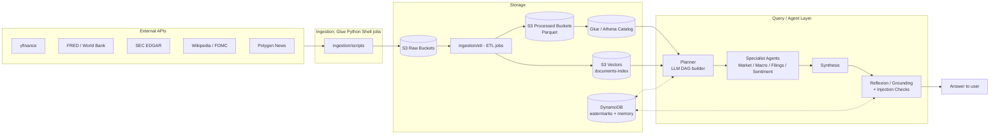

# Trade Platform

A global economic intelligence platform on AWS. It ingests market data, macro
indicators, SEC filings, Fed communications, news sentiment, and insider
trades on automated schedules, stores it in an Athena-backed data lake, and
exposes it through a multi-agent, Claude-powered query system with
conversation memory, semantic search, and self-critique guardrails. Two
parallel implementations of the query/agent layer exist side by side: an
original hand-rolled async orchestrator (`query/`) and a newer LangGraph-based
rewrite (`query_lg/`), documented separately below.

## Architecture

Data flows in one direction, source to answer:

1. **Ingestion** — scheduled AWS Glue Python Shell jobs (`ingestion/scripts/`)
   pull from each external API and land raw JSON in per-source S3 buckets.
2. **ETL** — Glue jobs (`ingestion/etl/`) transform raw JSON into canonical
   Parquet, partitioned per dataset, in separate "processed" S3 buckets. One
   ETL job (`etl_embed.py`) also chunks and embeds documents into S3 Vectors
   via Bedrock Cohere Embed v3.
3. **Storage** — Glue Crawlers keep an Athena/Glue Catalog schema in sync
   with both raw and processed buckets; S3 Vectors holds the semantic search
   index; DynamoDB holds ingestion watermarks and agent conversation memory.
4. **Query/Agent layer** — a FastAPI/CLI layer (`query/` or `query_lg/`)
   turns a natural-language question into a DAG of specialist agent calls
   against Athena and S3 Vectors, synthesizes their answers, and runs
   self-critique passes before returning a response.



## Key Features

- **Multi-agent DAG orchestration** — a planner LLM call produces a JSON DAG
  routing a question across four specialists (Market, Macro, Filings,
  Sentiment); independent nodes run concurrently, dependent nodes receive
  upstream agents' answers with a mandatory citation format.
- **Two orchestration implementations, same guardrail set**:
  - `query/` — a hand-rolled async orchestrator (`orchestrator.py` →
    `planner.py` → `dag_executor.py` → `sub_agents.py`), documented in depth
    in [`ORCHESTRATION_ARCHITECTURE.md`](ORCHESTRATION_ARCHITECTURE.md) and
    [`FLOW_REFERENCE.md`](FLOW_REFERENCE.md).
  - `query_lg/` — a LangGraph `StateGraph` rewrite (`graph.py`) with the same
    planner → dispatch → agent → reflexion → synthesis → injection-check
    shape, using LangGraph's native `Send()` fan-out, a persistent
    `AsyncSqliteSaver` checkpointer, and `interrupt()`/`Command(resume=...)`
    for mid-conversation clarification instead of an out-of-band pending-
    clarification record.
- **Reflexion self-critique** — every specialist's draft answer, and the
  final synthesized answer, is checked by a critic LLM call plus a
  deterministic grounding gate (numeric attribution/inversion checks) before
  being returned; a failing check triggers one bounded retry with explicit
  feedback, else a caveat is appended.
- **Grounding checks** — `check_attribution()`/`check_inversion()` (`query/`)
  and their `query_lg/reflexion.py` counterparts verify that numeric figures
  in an answer actually match values from the tool calls that produced it,
  replacing an earlier citation-syntax-only heuristic. See
  [`GROUNDING_CHECKS_IMPLEMENTATION.md`](GROUNDING_CHECKS_IMPLEMENTATION.md).
- **Prompt-injection defense** — tool results are wrapped in `<tool_result>`
  tags with matching system-prompt instructions (in-context defense), plus a
  post-hoc keyword-gated LLM judge (`check_injection_provenance()` /
  `injection_check_node`) that flags answers whose content looks steered by
  text embedded in a source document rather than the user's question.
- **Conversation memory** — DynamoDB-backed session history with rolling
  Haiku-generated summarization/compression after 8 raw turns, shared by
  both `query/` and `query_lg/` via the same `query/memory.py` module.
- **Eval harness + CI gate** — `query/evaluations/run_eval.py` runs a fixed
  question set through the real planner+executor (no mocking) and scores
  routing, tool selection, and grounding; `.github/workflows/eval-gate.yml`
  runs this on every PR touching `query/**` and blocks merge if the
  `stable`-tier pass rate drops below a threshold.

## Tech Stack

- **Infrastructure**: AWS CDK (Python), deployed via GitHub Actions OIDC
- **Ingestion/ETL**: AWS Glue (Python Shell jobs), S3, EventBridge-style cron
  schedules and conditional job triggers
- **Storage/Query**: S3, AWS Glue Data Catalog, Amazon Athena, DynamoDB, S3
  Vectors
- **AI/LLM**: Anthropic Claude (Haiku/Sonnet, model choice varies by
  dev/prod), Bedrock Cohere Embed v3 for embeddings, LangGraph + LangChain
  (`query_lg/`), LangSmith tracing
- **Application**: Python, FastAPI, Uvicorn, boto3, pandas
- **Secrets**: AWS Secrets Manager (with local env var fallback for every key)
- **Deployment**: Docker (two images — `Dockerfile` for `query/`,
  `Dockerfile.lg` for `query_lg/`), running on a single EC2 instance on
  different ports, deployed via SSH from GitHub Actions

## Repository Layout

```
trade-platform/
├── app.py                     # CDK entry point
├── cdk.json
├── Dockerfile / Dockerfile.lg # query/ and query_lg/ container images
├── trade_platform/            # CDK stack (all infrastructure)
├── ingestion/                 # Glue ETL + ingestion scripts, per-source YAML configs
├── query/                     # V1 query/agent layer (async orchestrator)
├── query_lg/                  # LangGraph query/agent layer
├── scripts/
│   ├── bootstrap_sp500.py     # one-shot Wikipedia -> EDGAR CIK mapping
│   └── maintenance/           # one-off debug/repair/verification scripts
├── tests/
│   ├── unit/                  # offline pytest suite (CDK stack, grounding checks)
│   └── integration/           # live tests — need a running server, AWS, or an LLM key
├── .github/workflows/         # deploy.yml (CDK + EC2 deploy), eval-gate.yml (PR eval gate)
├── PROJECT_OVERVIEW.md         # V1 query/ system, full code-grounded reference
├── ORCHESTRATION_ARCHITECTURE.md
├── FLOW_REFERENCE.md
├── GROUNDING_CHECKS_IMPLEMENTATION.md
└── .env.example
```

## Setup and Configuration

**Prerequisites**: Python 3.11, Node.js (for the AWS CDK CLI), an AWS
account with credentials configured, and an Anthropic API key.

1. Create and activate a virtualenv, then install dependencies:
   ```
   python -m venv .venv
   .venv\Scripts\activate       # Windows
   source .venv/bin/activate    # macOS/Linux
   pip install -r requirements.txt          # CDK
   pip install -r query/requirements.txt    # query/ (V1)
   pip install -r query_lg/requirements.txt # query_lg/ (LangGraph)
   npm install -g aws-cdk
   ```
2. Copy [`.env.example`](.env.example) to `.env` and fill in real values, or
   set the same variables in your shell. Every secret the code reads
   (Anthropic, FRED, Polygon, LangSmith, ...) also falls back to AWS Secrets
   Manager at `trade-platform/<env>/<name>` if the env var isn't set — see
   `.env.example` for the exact secret names.
3. Deploy infrastructure with the CDK:
   ```
   cdk synth
   cdk deploy TradePlatformStack-dev
   ```
   `trade_platform/trade_platform_stack.py` defines both a `-dev` and
   `-prod` stack instance (`app.py`); CI deploys `-dev` on every push to
   `master` via `.github/workflows/deploy.yml`. That workflow expects an
   `AWS_ROLE_ARN` repository variable (Settings -> Secrets and variables ->
   Actions -> Variables) pointing at the GitHub OIDC deploy role.

## Running Locally

**Query server (V1, `query/`)**:
```
python query/agent.py --question "What was AAPL's price performance over the last 90 days?"
python query/agent.py --session "my-session"          # interactive REPL
uvicorn query.server:app --host 0.0.0.0 --port 8000    # HTTP mode
```

**Query server (LangGraph, `query_lg/`)**:
```
python query_lg/ask.py "What was AAPL's price performance over the last 90 days?" --verbose
uvicorn query_lg.server:app --host 0.0.0.0 --port 8001 --workers 1
```
`query_lg/server.py` must run with exactly one worker — its checkpointer
holds a single long-lived SQLite connection (`checkpoints.sqlite`, overridable
via `QUERY_LG_DB_PATH`) that multiple worker processes would corrupt.

**Ingestion** (run individually, each Glue job's script is also a plain
Python entry point):
```
python ingestion/scripts/ingest_yfinance.py
python ingestion/etl/etl_yfinance.py
```
See `ingestion/configs/sources/*.yaml` for per-source schedule and
backfill configuration.

## Testing and Evaluation

```
pytest tests/unit -q            # offline unit tests (CDK stack synth, grounding checks)
```
`tests/integration/` holds tests that need a live Anthropic API key, a
running query server, or AWS access — not run in CI; each file's top-of-file
docstring notes what it needs and how to run it manually.

The eval harness (`query/evaluations/`) runs a fixed question set through
the real planner and executor, no mocking:
```
python query/evaluations/run_eval.py --category routing
python query/evaluations/check_gate.py results/run_<timestamp>/results.json --threshold 0.60
```
`.github/workflows/eval-gate.yml` runs this automatically on every PR that
touches `query/**` and fails the check if the `stable`-tier pass rate drops
below the threshold.

## Further Reading

- [`PROJECT_OVERVIEW.md`](PROJECT_OVERVIEW.md) — full code-grounded reference
  for the `query/` (V1) system: repo layout, infrastructure layer, ingestion
  pipeline, ETL layer, agent tools, and known gaps.
- [`ORCHESTRATION_ARCHITECTURE.md`](ORCHESTRATION_ARCHITECTURE.md) — traced
  request lifecycle, concurrency model, guardrails inventory, and the
  LangGraph translation map this rewrite was planned from.
- [`FLOW_REFERENCE.md`](FLOW_REFERENCE.md) — four concrete DAG shapes
  (single-agent, parallel, fan-out, merge) traced end-to-end through the
  code.
- [`GROUNDING_CHECKS_IMPLEMENTATION.md`](GROUNDING_CHECKS_IMPLEMENTATION.md)
  — the attribution/inversion grounding gate design and its revision
  history.

<!-- TODO: add screenshot -->

## License

MIT — see [`LICENSE`](LICENSE).

---

## Useful CDK Commands

This project's infrastructure is defined with the AWS CDK (Python).

- `cdk ls` — list all stacks in the app
- `cdk synth` — emit the synthesized CloudFormation template
- `cdk deploy` — deploy a stack to your configured AWS account/region
- `cdk diff` — compare the deployed stack with current local state
- `cdk docs` — open CDK documentation
